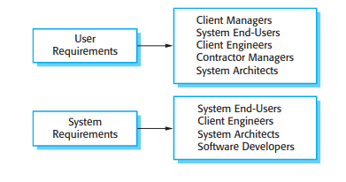
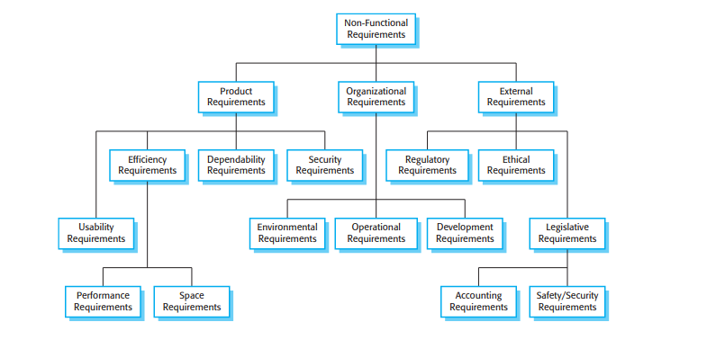
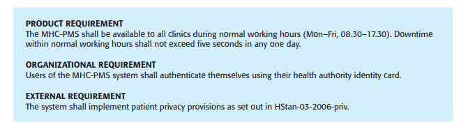

# Requisitos

## Functional Requirements

1. **User requirements** are statements, in a natural language plus diagrams, of what services the system is expected to provide to system users and the constraints under which it must operate.
2. **System requirements** are more detailed descriptions of the software system’s functions, services, and operational constraints. The system requirements document (sometimes called a functional specification) should define exactly what is to be implemented. It may be part of the contract between the system buyer and the software developers.

Exemplo:

Diferentes leitores dos requisitos funcionais:

## Non-Functional Requirements

Tipos de requisitos não funcionais:

Métricas para requisitos não funcionais:

Exemplo:

- Nota: no requisito organizacional do exemplo, login usando o cartão é obrigado pela organização, iria existir um requisito funcional semelhante 

### Product Requirements

These requirements specify or constrain the behavior of the software. Examples include performance requirements on how fast the system must execute and how much memory it requires, reliability requirements that set out the acceptable failure rate, security requirements, and usability requirements.

### Organizational requirements

These requirements are broad system requirements derived from policies and procedures in the customer’s and developer’s organization. Examples include operational process requirements that define how the system will be used, development process requirements that specify the programming language, the development environment or process standards to be used, and environmental requirements that specify the operating environment of the system.

### External requirements

This broad heading covers all requirements that are derived from factors external to the system and its development process. These may include regulatory requirements that set out what must be done for the system to be approved for use by a regulator, such as a central bank; legislative requirements that must be followed to ensure that the system operates within the law; and ethical requirements that ensure that the system will be acceptable to its users and the general public.